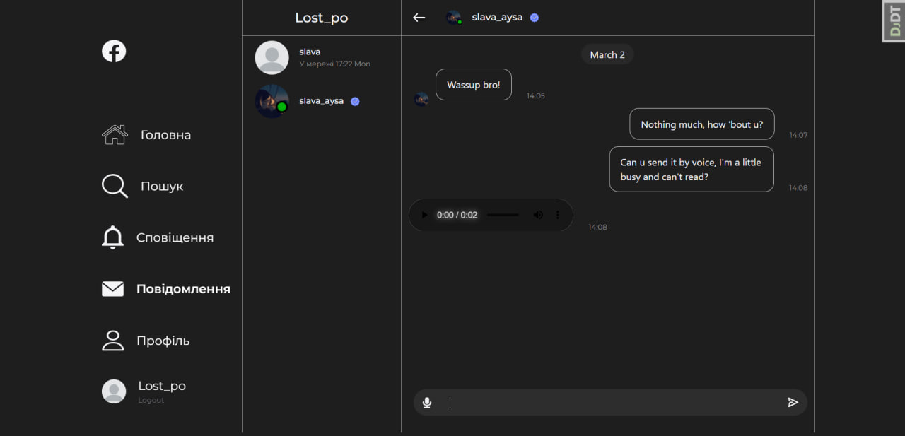
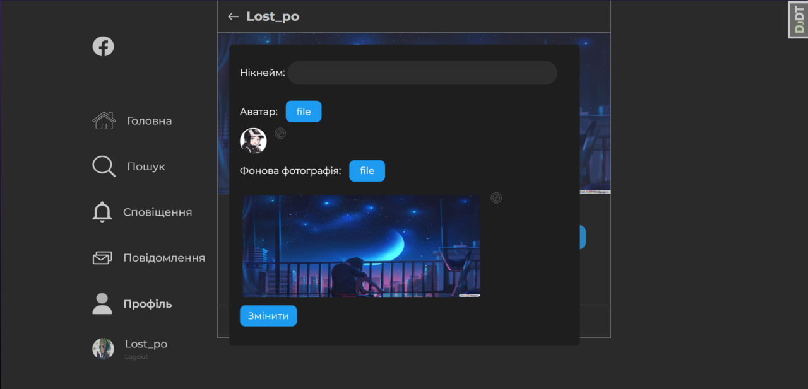
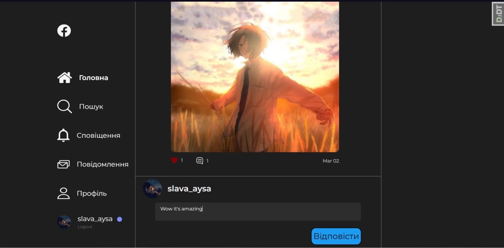
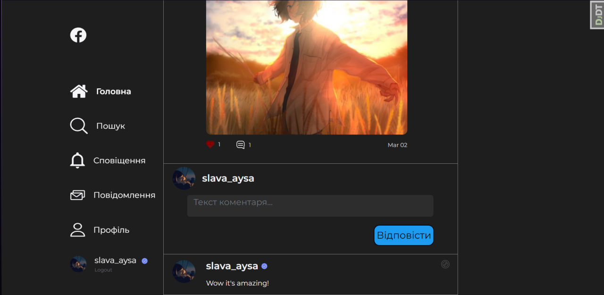
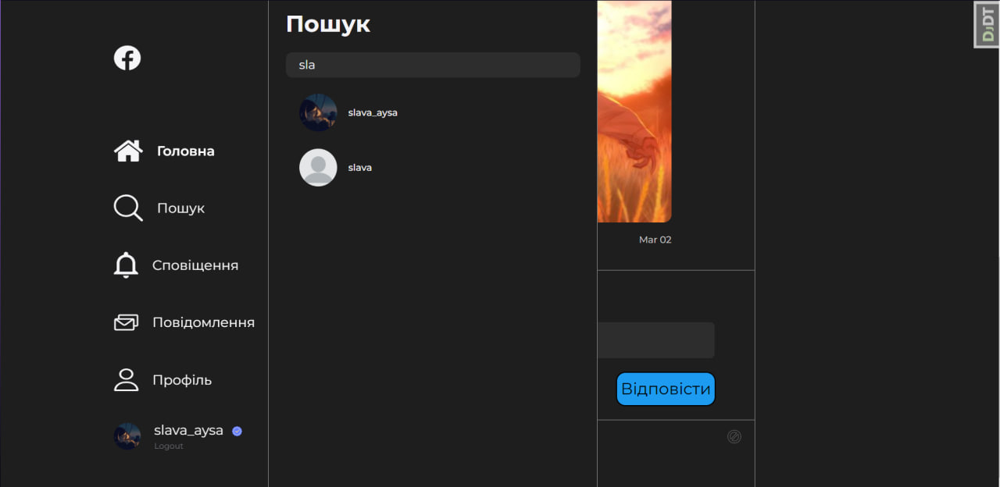

# Social_network  

## Запуск на локальній машині
___
Створіть файл .env у корені проекту з таким вмістом:
>SECRET_KEY=<span style="color:#73b33b">YOUR_SECRET_KEY</span>   
NAME=<span style="color:#73b33b">YOUR_NAME</span> *(database)*  
USER=<span style="color:#73b33b">YOUR_USERNAME</span> *(database)*     
PASSWORD=<span style="color:#73b33b">YOUR_PASSWORD</span> *(database)*    
HOST=<span style="color:#73b33b">YOUR_HOST</span> *(database)*    
PORT=<span style="color:#73b33b">YOUR_PORT</span> *(database)*    

Щоб запустити проєкт необхідно включити сервер з базою даних(MySQL) прописати наступні команди в корені директорії Social-Network:  
Step 1:
```
git clone https://github.com/Alekssin1/Social-Network.git
```
Step 2 "Installing all project dependencies":
```
pip install -r requirements.txt  
```  
Step 3:
```  
python manage.py makemigrations  
```  
Step 4 "Database creating":
```  
python manage.py migrate  
```  
Step 5 "Start project":
```  
python manage.py runserver
```  
___








This social network implements a system of likes, subscriptions, adding comments, correspondence between two users both by voice and text messages, creating posts and a personal account that can be edited (avatar, background, nickname)